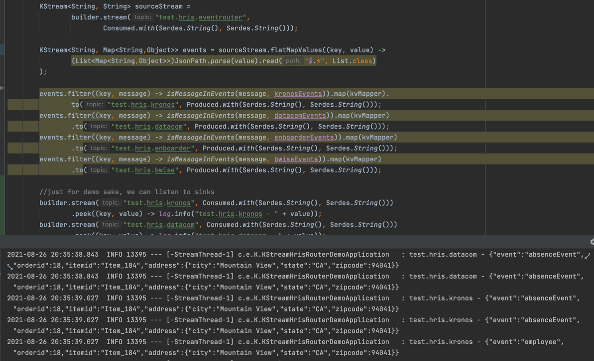

#Spring Kafka KStream HRIS Event Router Demo

## Overview
This demo is pretty simple and shows you how spring-kafka KStreams can be used to
to develop event streaming microservice. 

The image shows a source stream "test.hris.eventrouter" which will be consumed by subsequent steps. 
We then create stream of "events" from source stream and then from there we filter the stream records
based on the events and sink to target topics.

NOTE: I can't use branching because I can't sink same record to multiple topics. 

